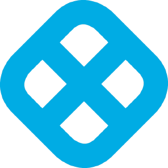

<!-- Improved compatibility of back to top link: See: https://github.com/othneildrew/Best-README-Template/pull/73 -->
<a name="readme-top"></a>
<!--
*** Thanks for checking out the Best-README-Template. If you have a suggestion
*** that would make this better, please fork the repo and create a pull request
*** or simply open an issue with the tag "enhancement".
*** Don't forget to give the project a star!
*** Thanks again! Now go create something AMAZING! :D
-->


<!-- PROJECT SHIELDS -->
<!--
*** I'm using markdown "reference style" links for readability.
*** Reference links are enclosed in brackets [ ] instead of parentheses ( ).
*** See the bottom of this document for the declaration of the reference variables
*** for contributors-url, forks-url, etc. This is an optional, concise syntax you may use.
*** https://www.markdownguide.org/basic-syntax/#reference-style-links
-->
[![Contributors][contributors-shield]][contributors-url]
[![Forks][forks-shield]][forks-url]
[![Stargazers][stars-shield]][stars-url]
[![Issues][issues-shield]][issues-url]
[![MIT License][license-shield]][license-url]
[![LinkedIn][linkedin-shield]][linkedin-url]


<!-- PROJECT LOGO -->
<br />
<div align="center">
  <a href="https://harness.io">
    
  </a>

  <h3 align="center">Instruqt Harness Lab User Manager (Anbu Automation)</h3>

  <p align="center">
    An awesome python util to handle Harness Lab Users for Instruqt tracks!
    <br />
    <a href="https://developer.harness.io/" target="_blank"><strong>Explore the Developer Hub »</strong></a>
    <br />
    <br />
    <a href="https://github.com/gacerioni/instruqt-harness-lab-user-manager">View Demo (soon)</a>
    ·
    <a href="https://github.com/gacerioni/instruqt-harness-lab-user-manager/issues">Report Bug</a>
    ·
    <a href="https://github.com/gacerioni/instruqt-harness-lab-user-manager/issues">Request Feature</a>
  </p>
</div>


<!-- TABLE OF CONTENTS -->
<details>
  <summary>Table of Contents</summary>
  <ol>
    <li>
      <a href="#about-the-project">About The Project</a>
      <ul>
        <li><a href="#built-with">Built With</a></li>
      </ul>
    </li>
    <li>
      <a href="#getting-started">Getting Started</a>
      <ul>
        <li><a href="#prerequisites">Prerequisites</a></li>
        <li><a href="#installation">Installation</a></li>
      </ul>
    </li>
    <li><a href="#usage">Usage</a></li>
    <li><a href="#roadmap">Roadmap</a></li>
    <li><a href="#contributing">Contributing</a></li>
    <li><a href="#license">License</a></li>
    <li><a href="#contact">Contact</a></li>
    <li><a href="#acknowledgments">Acknowledgments</a></li>
  </ol>
</details>


<!-- ABOUT THE PROJECT -->
## About The Project

[![Product Name Screen Shot][product-screenshot]](https://example.com)

This is just a simple handler to give us a free slot for taking Harness Certification exams using a Sandbox Account.

This code will then use Terraform to manage the Lab lifecycle, and reset everything to the initial state.

Why? Because we want to re-use the `harness sandbox project + lab student user` combo.

This is the current mechanism description:
* It gets the password from Vault
* Then, it picks one free slot from the Harness User Farm (managed by Terraform)
* It will parse everything and give it to Instruqt at runtime, so we can present this to the user doing the exam.


<p align="right">(<a href="#readme-top">back to top</a>)</p>


### Built With

* [![Harness][Harness]][Harness-url]
* [![Python][Python]][Python-url]
* [![AirTable][AirTable]][AirTable-url]
* [![Vault][Vault]][Vault-url]

<p align="right">(<a href="#readme-top">back to top</a>)</p>


<!-- GETTING STARTED -->
## Getting Started

This is an example of how you may give instructions on setting up your project locally.
To get a local copy up and running follow these simple example steps.

### Prerequisites

This is an example of how to list things you need to use the software and how to install them.
* npm
  ```sh
  npm install npm@latest -g
  ```

### Installation

_Below is an example of how you can instruct your audience on installing and setting up your app. This template doesn't rely on any external dependencies or services._

1. Get a free API Key at [https://example.com](https://example.com)
2. Clone the repo
   ```sh
   git clone https://github.com/your_username_/Project-Name.git
   ```
3. Install NPM packages
   ```sh
   npm install
   ```
4. Enter your API in `config.js`
   ```js
   const API_KEY = 'ENTER YOUR API';
   ```

<p align="right">(<a href="#readme-top">back to top</a>)</p>


<!-- USAGE EXAMPLES -->
## Usage

Use this space to show useful examples of how a project can be used. Additional screenshots, code examples and demos work well in this space. You may also link to more resources.

_For more examples, please refer to the [Documentation](https://example.com)_

<p align="right">(<a href="#readme-top">back to top</a>)</p>


<!-- ROADMAP -->
## Roadmap

- [x] Add Changelog
- [x] Add back to top links
- [ ] Add Additional Templates w/ Examples
- [ ] Add "components" document to easily copy & paste sections of the readme
- [ ] Multi-language Support
    - [ ] Chinese
    - [ ] Spanish

See the [open issues](https://github.com/othneildrew/Best-README-Template/issues) for a full list of proposed features (and known issues).

<p align="right">(<a href="#readme-top">back to top</a>)</p>


<!-- CONTRIBUTING -->
## Contributing

Contributions are what make the open source community such an amazing place to learn, inspire, and create. Any contributions you make are **greatly appreciated**.

If you have a suggestion that would make this better, please fork the repo and create a pull request. You can also simply open an issue with the tag "enhancement".
Don't forget to give the project a star! Thanks again!

1. Fork the Project
2. Create your Feature Branch (`git checkout -b feature/AmazingFeature`)
3. Commit your Changes (`git commit -m 'Add some AmazingFeature'`)
4. Push to the Branch (`git push origin feature/AmazingFeature`)
5. Open a Pull Request

<p align="right">(<a href="#readme-top">back to top</a>)</p>


<!-- LICENSE -->
## License

Distributed under the MIT License. See `LICENSE.txt` for more information.

<p align="right">(<a href="#readme-top">back to top</a>)</p>


<!-- CONTACT -->
## Contact

Your Name - [@your_twitter](https://twitter.com/your_username) - email@example.com

Project Link: [https://github.com/your_username/repo_name](https://github.com/your_username/repo_name)

<p align="right">(<a href="#readme-top">back to top</a>)</p>


<!-- ACKNOWLEDGMENTS -->
## Acknowledgments

Use this space to list resources you find helpful and would like to give credit to. I've included a few of my favorites to kick things off!

* [Choose an Open Source License](https://choosealicense.com)
* [GitHub Emoji Cheat Sheet](https://www.webpagefx.com/tools/emoji-cheat-sheet)
* [Malven's Flexbox Cheatsheet](https://flexbox.malven.co/)
* [Malven's Grid Cheatsheet](https://grid.malven.co/)
* [Img Shields](https://shields.io)
* [GitHub Pages](https://pages.github.com)
* [Font Awesome](https://fontawesome.com)
* [React Icons](https://react-icons.github.io/react-icons/search)

<p align="right">(<a href="#readme-top">back to top</a>)</p>


<!-- MARKDOWN LINKS & IMAGES -->
<!-- https://www.markdownguide.org/basic-syntax/#reference-style-links -->
[contributors-shield]: https://img.shields.io/github/contributors/gacerioni/instruqt-harness-lab-user-manager.svg?style=for-the-badge
[contributors-url]: https://github.com/gacerioni/instruqt-harness-lab-user-manager/graphs/contributors
[forks-shield]: https://img.shields.io/github/forks/gacerioni/instruqt-harness-lab-user-manager.svg?style=for-the-badge
[forks-url]: https://github.com/gacerioni/instruqt-harness-lab-user-manager/network/members
[stars-shield]: https://img.shields.io/github/stars/gacerioni/instruqt-harness-lab-user-manager.svg?style=for-the-badge
[stars-url]: https://github.com/gacerioni/instruqt-harness-lab-user-manager/stargazers
[issues-shield]: https://img.shields.io/github/issues/gacerioni/instruqt-harness-lab-user-manager.svg?style=for-the-badge
[issues-url]: https://github.com/gacerioni/instruqt-harness-lab-user-manager/issues
[license-shield]: https://img.shields.io/github/license/gacerioni/instruqt-harness-lab-user-manager.svg?style=for-the-badge
[license-url]: https://github.com/gacerioni/instruqt-harness-lab-user-manager/blob/master/LICENSE.txt
[linkedin-shield]: https://img.shields.io/badge/-LinkedIn-black.svg?style=for-the-badge&logo=linkedin&colorB=555
[linkedin-url]: https://linkedin.com/in/gabrielcerioni
[product-screenshot]: images/canary_small.png
[Python]: https://img.shields.io/badge/Python-3776AB?style=for-the-badge&logo=python&logoColor=white
[Python-url]: https://www.python.org/
[AirTable]: [https://img.shields.io/badge/Python-3776AB?style=for-the-badge&logo=python&logoColor=white](https://img.shields.io/badge/airtable%AE-F0F8FF.svg?style=for-the-badge&logo=data:image/png;base64,iVBORw0KGgoAAAANSUhEUgAAAA4AAAAOCAMAAAAolt3jAAAAIGNIUk0AAHomAACAhAAA+gAAAIDoAAB1MAAA6mAAADqYAAAXcJy6UTwAAAEgUExURQAAAP/MADu35cYoQsgpQzHC8u0wSQD//zLC8zPB8zHC8//MAP/MAP/MAP/MAP/MAP/MAP/MAP/MAP/MAP/MAP/MAP/MAP/jAP/NAP/MAP/MAP/OANdDOfOsDf/PAP/OAP/MAP/MANbKMU/Dz+ItR84nRcctQOJ5If3HAv/PAP/NAP/MAP/MAPXMC5PHfzfC6y3C9zDC88UmQ8UlQ9FGNviyCNDLN1TEyS7C9i/C9cYnQs4HOifF/TDC8+0wSeovSNEqRMQoQjHC8u0wSe0wSe0wSe8wSe0wSe0wSTHC8jHC8jHC8jHC8jHC8jHC8jHC8jHC8jHC8jHC8jHC8jHC8jHC8jHC8v/MAO0wSeYvSNAqRDHC8ukvSNQrRccoQv///8tVmKwAAABXdFJOUwAAAAAAAAAAAAAACB9ptrVoOo7b/to5GaTzohhIZqTk5KRmSvPHflp+xvb1xX9dgsn05aVnUVdtq+i/IHT9+sJhFYnyu1gQOw7lqov1xHQqBGWaRg8FAasaB0sAAAABYktHRF9z0VEtAAAAB3RJTUUH5wUCFCoE1lXF/AAAAKBJREFUCNc1x0UWwkAQANEO0EGCu7u7u7s7JDDA/Y8BZKA29T4A843jxIEotUar06tFM5zBaDLzvNlitHIM2OwO/pfD6QK3x+uj8geCIQhHorF4IplKZ7K5fAGE271YKleqtXqDEAKC8Hi+mq12hxDKbq8/kAwJ5Wg8mUpl+OdszrKsnHKxhA9YUOCKrDfb3R7EFHg4ns6ISKnEyxVRhfAGxo8h1F6iLlQAAAAldEVYdGRhdGU6Y3JlYXRlADIwMjMtMDUtMDJUMjA6NDE6NTYrMDA6MDAZi4QkAAAAJXRFWHRkYXRlOm1vZGlmeQAyMDIzLTA1LTAyVDIwOjQxOjU2KzAwOjAwaNY8mAAAACh0RVh0ZGF0ZTp0aW1lc3RhbXAAMjAyMy0wNS0wMlQyMDo0MjowNCswMDowMAuLuQkAAAAASUVORK5CYII=)
[AirTable-url]: https://airtable.com/
[Vault]: https://img.shields.io/badge/Vault-FFFFFF?style=for-the-badge&logo=vault&logoColor=black
[Vault-url]: https://www.vaultproject.io/
[Harness]: https://img.shields.io/badge/harness%AE-F0F8FF.svg?style=for-the-badge&logo=data:image/png;base64,iVBORw0KGgoAAAANSUhEUgAAAA4AAAAOCAMAAAAolt3jAAAAIGNIUk0AAHomAACAhAAA+gAAAIDoAAB1MAAA6mAAADqYAAAXcJy6UTwAAABUUExURQAAAASp3gCt5gCs4wCs5AGr4wCs4wCs5ACs5ACs4wGr4gGs4wCs5ACs5AGr4wCs5ACs5AGr4wGr4wCs5AGr4wGs4wCs5AGr4gCs5AGr4wCs5P///2jdN0IAAAAadFJOUwAAAAAAIqv49KMhIbryIbzNQ0f3VlXEKMxVu8AlKAAAAAFiS0dEGwJg1KQAAAAHdElNRQfnBQIUFScs7J6yAAAAgklEQVQI102P1w7DMAwDFU951SP1KP//Q5sgadAn4QCBPBJtQmpj2XkpNjpIhYjEiEEdLNQro9RWkF9KkAwZ+1upviMHST5ix5hzHCdqcih9YC2MXmCIuam5gDVVTZZsqj9szGRQPs+zI/0f5a+i/hRdGq3eGpckp1vynOAdW6PPCV9bwwqge0s5SQAAACV0RVh0ZGF0ZTpjcmVhdGUAMjAyMy0wNS0wMlQyMDoyMToxNSswMDowMEScWgAAAAAldEVYdGRhdGU6bW9kaWZ5ADIwMjMtMDUtMDJUMjA6MjE6MTUrMDA6MDA1weK8AAAAKHRFWHRkYXRlOnRpbWVzdGFtcAAyMDIzLTA1LTAyVDIwOjIxOjM5KzAwOjAw51GuagAAAABJRU5ErkJggg==
[Harness-url]: https://harness.io
[Next.js]: https://img.shields.io/badge/next.js-000000?style=for-the-badge&logo=nextdotjs&logoColor=white
[Next-url]: https://nextjs.org/
[React.js]: https://img.shields.io/badge/React-20232A?style=for-the-badge&logo=react&logoColor=61DAFB
[React-url]: https://reactjs.org/
[Vue.js]: https://img.shields.io/badge/Vue.js-35495E?style=for-the-badge&logo=vuedotjs&logoColor=4FC08D
[Vue-url]: https://vuejs.org/
[Angular.io]: https://img.shields.io/badge/Angular-DD0031?style=for-the-badge&logo=angular&logoColor=white
[Angular-url]: https://angular.io/
[Svelte.dev]: https://img.shields.io/badge/Svelte-4A4A55?style=for-the-badge&logo=svelte&logoColor=FF3E00
[Svelte-url]: https://svelte.dev/
[Laravel.com]: https://img.shields.io/badge/Laravel-FF2D20?style=for-the-badge&logo=laravel&logoColor=white
[Laravel-url]: https://laravel.com
[Bootstrap.com]: https://img.shields.io/badge/Bootstrap-563D7C?style=for-the-badge&logo=bootstrap&logoColor=white
[Bootstrap-url]: https://getbootstrap.com
[JQuery.com]: https://img.shields.io/badge/jQuery-0769AD?style=for-the-badge&logo=jquery&logoColor=white
[JQuery-url]: https://jquery.com 
